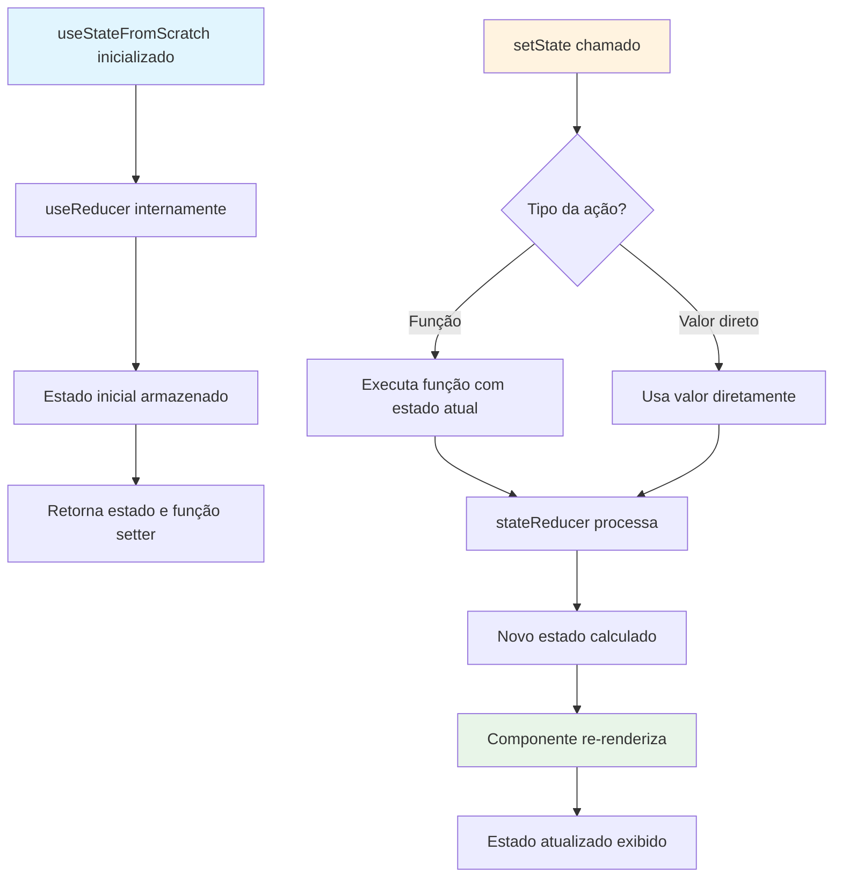
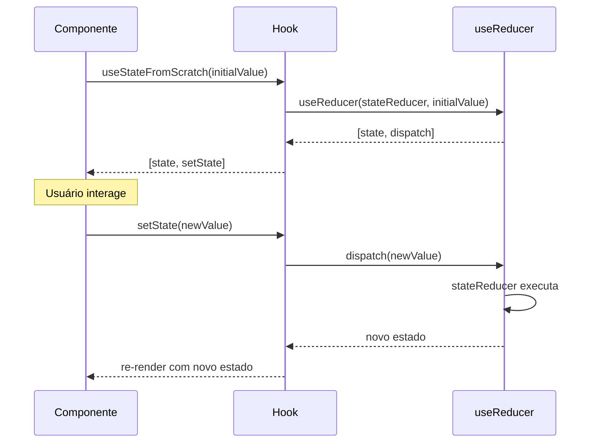
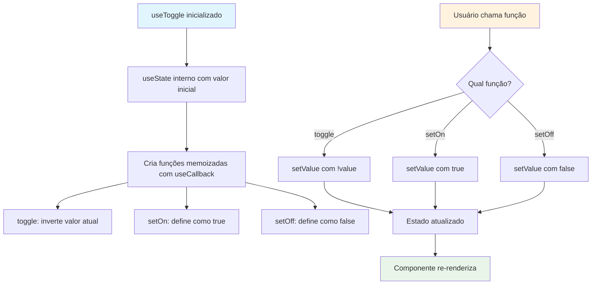
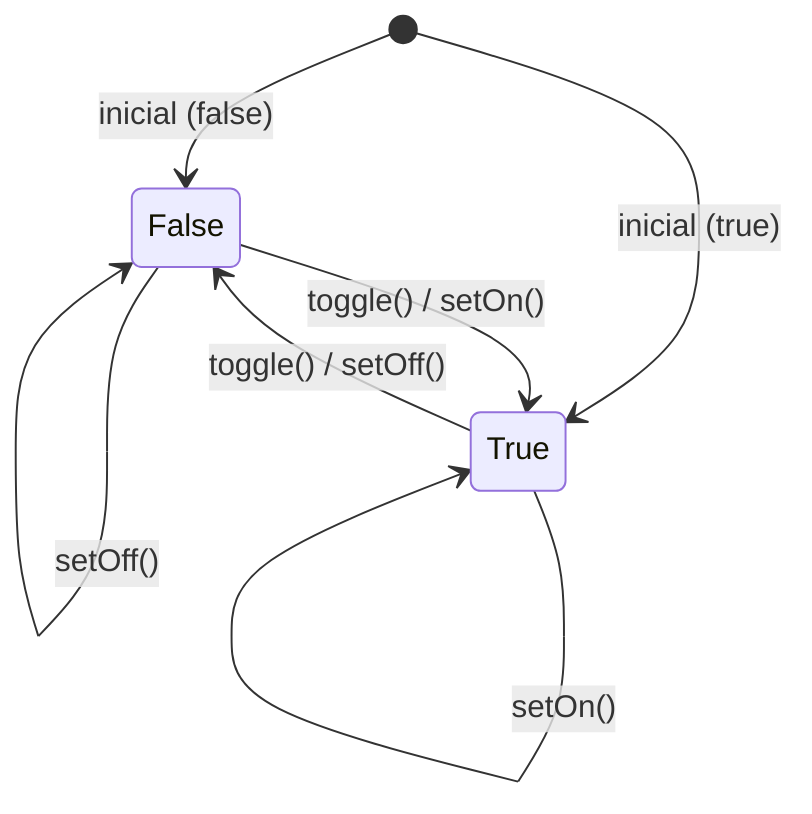
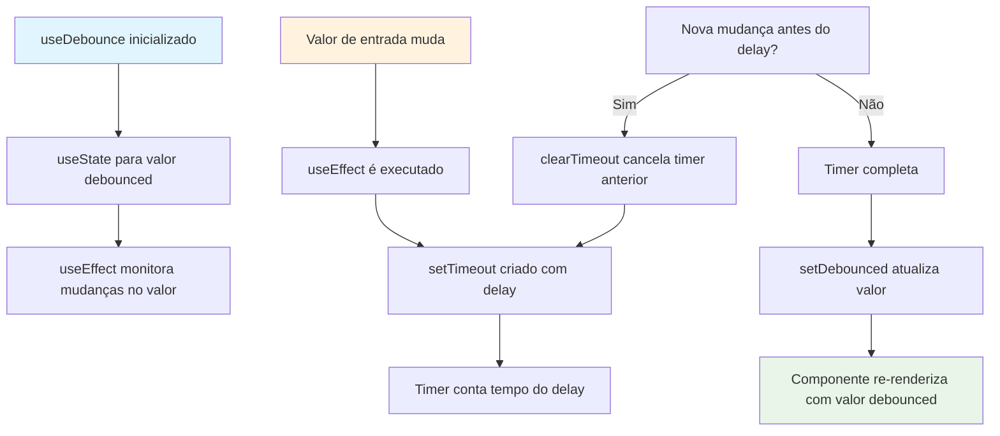
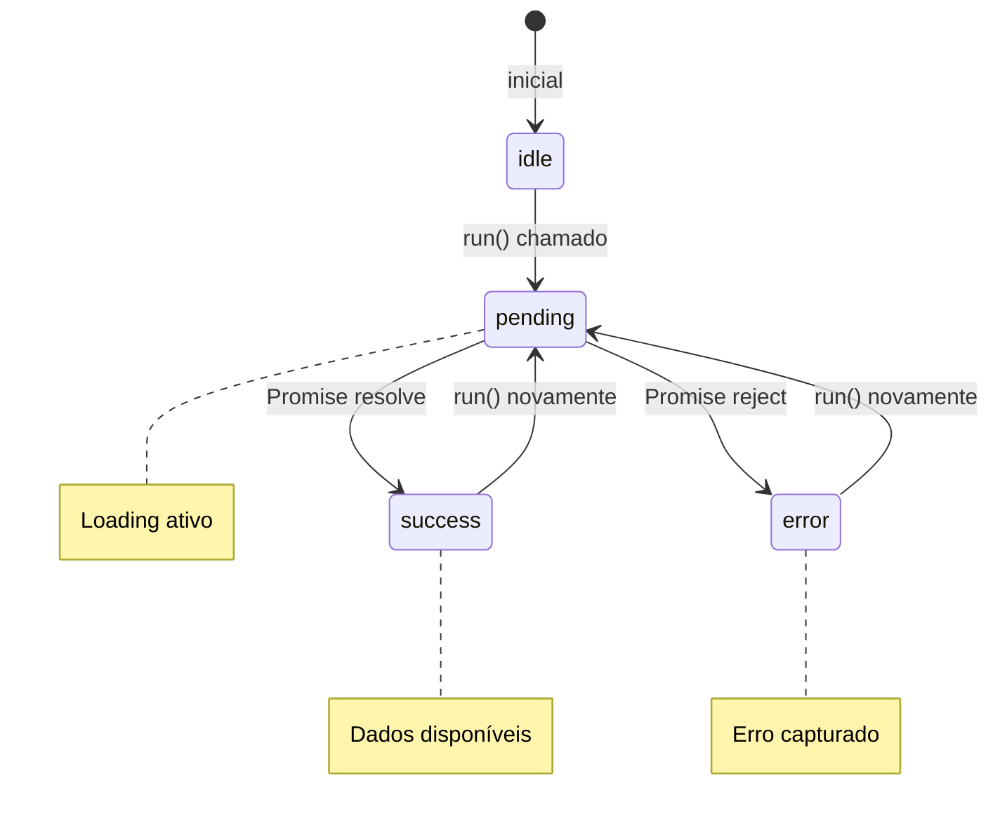
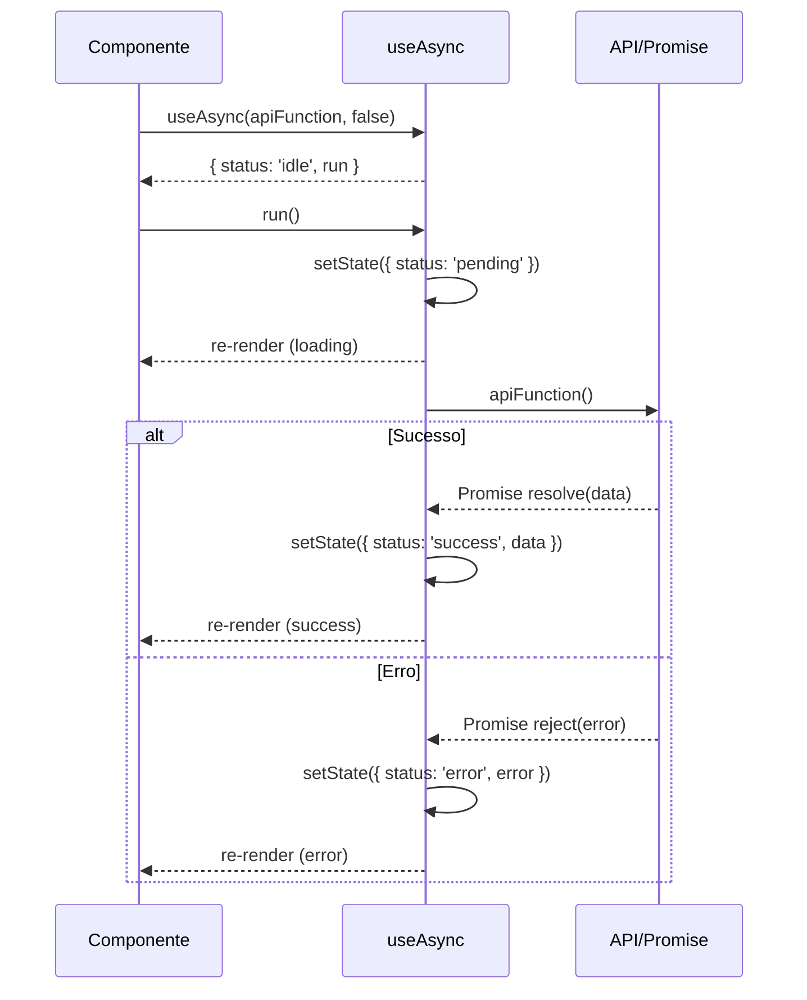
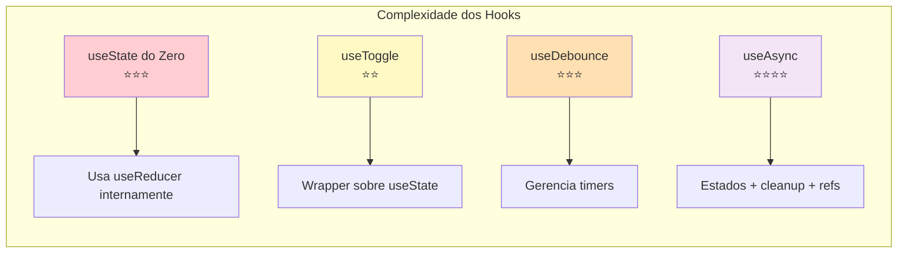
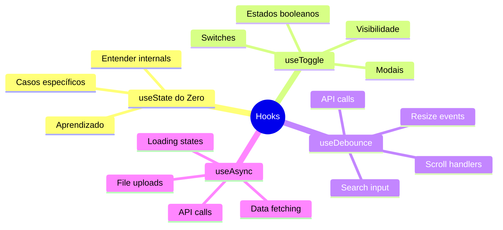

# Diagramas dos Hooks - Como Funcionam

Este arquivo contém diagramas Mermaid que explicam o funcionamento interno de cada hook implementado no projeto.

## 1. useState do Zero (useStateFromScratch)



### Fluxo de Dados do useState do Zero:



## 2. useToggle Hook



### Estados do useToggle:



## 3. useDebounce Hook



### Timeline do useDebounce:

```mermaid
gantt
    title Timeline do useDebounce (delay: 600ms)
    dateFormat X
    axisFormat %L ms
    
    section Input Changes
    Input "A"           :0, 100
    Input "AB"          :200, 300
    Input "ABC"         :400, 500
    Input "ABCD"        :600, 700
    
    section Timers
    Timer 1 (cancelado) :0, 200
    Timer 2 (cancelado) :200, 400
    Timer 3 (cancelado) :400, 600
    Timer 4 (completo)  :600, 1200
    
    section Output
    Output updates      :milestone, 1200, 1200
```



## 4. useAsync Hook

```mermaid
graph TD
    A[useAsync inicializado] --> B[Estado inicial: 'idle']
    B --> C[useRef para controle mounted]
    
    D[run() chamado] --> E[Estado: 'pending']
    E --> F[asyncFn executado]
    
    F --> G{Promessa resolvida?}
    G -->|Sucesso| H{Componente ainda mounted?}
    G -->|Erro| I{Componente ainda mounted?}
    
    H -->|Sim| J[Estado: 'success' + data]
    H -->|Não| K[Ignora resultado]
    I -->|Sim| L[Estado: 'error' + error]
    I -->|Não| K
    
    J --> M[Componente re-renderiza]
    L --> M
    K --> N[Previne memory leak]
    
    style A fill:#e1f5fe
    style D fill:#fff3e0
    style M fill:#e8f5e8
    style N fill:#ffebee
```

### Estados do useAsync:



### Fluxo Completo do useAsync:



## 5. Comparação de Complexidade



## 6. Quando Usar Cada Hook



---

# 📝 Explicações Técnicas Detalhadas

## 1. useState do Zero - Funcionamento Interno

### Como o React useState "Real" Funciona
O `useState` nativo do React funciona através de um sistema complexo de **Fiber nodes** e **hooks dispatcher**. Cada componente possui uma lista ligada de hooks que mantém o estado entre re-renderizações. O React usa um índice interno para rastrear qual hook está sendo chamado em cada renderização.

### Nossa Implementação com useReducer
```typescript
function useStateFromScratch<T>(initialState: T): [T, (action: SetStateAction<T>) => void] {
  return useReducer(stateReducer<T>, initialState);
}
```

**Por que useReducer?** 
- `useReducer` é mais primitivo que `useState` no React
- Na verdade, `useState` é implementado internamente usando `useReducer`
- Nossa implementação replica esse comportamento

### O stateReducer Explicado
```typescript
function stateReducer<T>(state: T, action: SetStateAction<T>): T {
  return typeof action === 'function' 
    ? (action as (prevState: T) => T)(state)
    : action;
}
```

**Detalhes do Funcionamento:**
1. **Entrada:** Recebe o estado atual e uma "ação" (que pode ser um valor ou função)
2. **Verificação de Tipo:** Usa `typeof action === 'function'` para determinar se é:
   - **Função:** Como `setState(prev => prev + 1)` - executa a função passando o estado atual
   - **Valor:** Como `setState(5)` - retorna o valor diretamente
3. **Type Casting:** O `(action as (prevState: T) => T)` é necessário porque TypeScript não consegue inferir automaticamente que a função tem a assinatura correta
4. **Imutabilidade:** Sempre retorna um novo valor, nunca modifica o estado existente

### Fluxo Completo de Execução
1. **Inicialização:** `useReducer` armazena o `initialState` na **fiber node** do componente
2. **Chamada setState:** Quando `setState(newValue)` é chamado, dispara o `dispatch` do `useReducer`
3. **Processamento:** O `stateReducer` processa a ação e calcula o novo estado
4. **Comparação:** React compara o novo estado com o anterior usando `Object.is()`
5. **Re-renderização:** Se diferentes, agenda uma re-renderização do componente
6. **Reconciliação:** React atualiza o DOM apenas onde necessário

---

## 2. useToggle - Otimização com useCallback

### Estrutura Interna
```typescript
export function useToggle(initial = false) {
  const [value, setValue] = useState<boolean>(initial);
  const toggle = useCallback(() => setValue(v => !v), []);
  const setOn = useCallback(() => setValue(true), []);
  const setOff = useCallback(() => setValue(false), []);
  return { value, toggle, setOn, setOff } as const;
}
```

### Por que useCallback?
**Sem useCallback:** A cada renderização, novas funções seriam criadas:
```typescript
// ❌ Problemático - novas funções a cada render
const toggle = () => setValue(v => !v);
const setOn = () => setValue(true);
```

**Com useCallback:** As funções são memoizadas:
```typescript
// ✅ Otimizado - mesmas funções referenciadas
const toggle = useCallback(() => setValue(v => !v), []);
```

### Análise do Array de Dependências
- **`[]` (array vazio):** As funções nunca mudam porque não dependem de nenhum valor externo
- **setValue é estável:** O React garante que a função `setValue` retornada por `useState` é sempre a mesma referência
- **Closure captura:** As funções capturam o `setValue` no momento da criação e o mantêm

### Impacto na Performance
1. **Evita re-renderizações desnecessárias** em componentes filhos que recebem essas funções como props
2. **Reduz garbage collection** - menos objetos função criados
3. **Melhora comparações de dependência** em outros `useCallback`/`useEffect`

### Padrão Functional Update
```typescript
setValue(v => !v)  // ✅ Funcional - sempre recebe o estado mais atual
setValue(!value)   // ❌ Closure - pode usar estado "stale"
```

---

## 3. useDebounce - Gerenciamento de Side Effects

### Implementação Completa
```typescript
export function useDebounce<T>(value: T, delay = 500) {
  const [debounced, setDebounced] = useState(value);
  
  useEffect(() => {
    const id = setTimeout(() => setDebounced(value), delay);
    return () => clearTimeout(id);
  }, [value, delay]);
  
  return debounced;
}
```

### Análise do useEffect

#### 1. **Timing do Effect**
- **Execução:** Após cada render onde `value` ou `delay` mudaram
- **Assíncrono:** `useEffect` não bloqueia a renderização
- **Batching:** React pode agrupar múltiplas mudanças de estado

#### 2. **Closure e Capture**
```typescript
const id = setTimeout(() => setDebounced(value), delay);
```
- **Closure Capture:** A função arrow captura o `value` atual no momento da criação
- **Stale Closure:** Se o `value` mudar antes do timeout, a função ainda tem o valor "antigo" capturado
- **Isso é intencional:** Queremos que cada timeout use o valor que estava ativo quando foi criado

#### 3. **Cleanup Function**
```typescript
return () => clearTimeout(id);
```
- **Quando executa:** 
  - Antes do próximo effect executar
  - Quando o componente desmonta
  - Se as dependências `[value, delay]` mudarem
- **Por que é crucial:** Previne que timeouts "órfãos" executem e atualizem estado de componente desmontado

### Fluxo Temporal Detalhado
```
t=0ms:   value="A", setTimeout(A, 600ms), id=1
t=200ms: value="AB", clearTimeout(1), setTimeout(AB, 600ms), id=2  
t=400ms: value="ABC", clearTimeout(2), setTimeout(ABC, 600ms), id=3
t=600ms: value="ABCD", clearTimeout(3), setTimeout(ABCD, 600ms), id=4
t=1200ms: timeout executes, setDebounced("ABCD")
```

### Race Conditions e Memory Leaks
**Sem cleanup:**
```typescript
// ❌ Perigoso
useEffect(() => {
  setTimeout(() => setDebounced(value), delay);
}, [value, delay]);
```
**Problemas:**
- Múltiplos timeouts executando simultaneamente
- Estado atualizado após desmontagem do componente
- Comportamento imprevisível

---

## 4. useAsync - Gerenciamento de Estado Complexo

### Estrutura de Estado
```typescript
interface State<T> {
  data?: T;          // Dados da operação bem-sucedida
  error?: unknown;   // Erro capturado
  status: 'idle' | 'pending' | 'success' | 'error';
}
```

### Estados Mutuamente Exclusivos
- **idle:** Estado inicial, nenhuma operação executada
- **pending:** Operação em andamento, `data` e `error` podem estar presentes de execuções anteriores
- **success:** Operação completada, `data` disponível, `error` undefined
- **error:** Operação falhou, `error` disponível, `data` pode estar presente de execução anterior bem-sucedida

### Controle de Memory Leak
```typescript
const mounted = useRef(true);
useEffect(() => () => { mounted.current = false; }, []);
```

**Padrão de Cleanup:**
1. **useRef persiste** entre re-renderizações mas não dispara re-renders
2. **useEffect com array vazio** executa apenas na montagem
3. **Cleanup function** executa apenas na desmontagem
4. **mounted.current = false** sinaliza que componente não existe mais

### Análise da Função run()
```typescript
const run = useCallback(async () => {
  setState({ status: 'pending' });
  try {
    const data = await asyncFn();
    if (!mounted.current) return; // 🔑 Verificação crucial
    setState({ status: 'success', data });
    return data;
  } catch (error) {
    if (!mounted.current) return; // 🔑 Verificação crucial
    setState({ status: 'error', error });
    throw error;
  }
}, [asyncFn]);
```

### Por que as Verificações `mounted.current`?
**Cenário problemático:**
1. Componente monta e chama `run()`
2. Operação async inicia (fetch, timeout, etc.)
3. Usuário navega para outra página → componente desmonta
4. Operação async completa e tenta chamar `setState`
5. **React Warning:** "Can't perform a React state update on an unmounted component"

**Nossa solução:**
- Verificamos `mounted.current` antes de cada `setState`
- Se `false`, simplesmente ignoramos o resultado
- Previne warnings e potenciais memory leaks

### useCallback Dependency Array
```typescript
const run = useCallback(async () => { /* ... */ }, [asyncFn]);
```
- **`asyncFn` na dependência:** Se a função async mudar, `run` é recriada
- **Importante para:** Casos onde `asyncFn` depende de props ou estado
- **Evita closures stale:** Garante que sempre usamos a versão mais atual da função

### Padrão de Estado Optimista
O hook permite estados "residuais":
```typescript
// Estado após sucesso anterior:
{ status: 'pending', data: 'resultado anterior', error: undefined }
```
Isso permite **UI optimista** onde mostramos dados anteriores durante loading de novos dados.

---

## Benefícios de Cada Hook

| Hook | Benefício Principal | Casos de Uso | Complexidade Técnica |
|------|---------------------|--------------|---------------------|
| **useState do Zero** | Entendimento profundo dos internals do React | Educação, implementações específicas | ⭐⭐⭐ Reducer pattern |
| **useToggle** | API ergonômica para booleanos | Modais, switches, visibilidade | ⭐⭐ Memoization |
| **useDebounce** | Controle de frequência de execução | Busca, eventos, performance | ⭐⭐⭐ Timer management |
| **useAsync** | Estado complexo + cleanup + error handling | APIs, uploads, operações async | ⭐⭐⭐⭐ Lifecycle + refs |

## Conceitos Fundamentais Aplicados

### 1. **Closures e Lexical Scoping**
- Todas as funções dos hooks "capturam" variáveis do escopo onde foram criadas
- `useCallback` congela essas capturas até as dependências mudarem

### 2. **Immutability**
- Todo estado é sempre substituído, nunca mutado
- Permite comparações eficientes com `Object.is()`

### 3. **Side Effect Management**
- `useEffect` para operações que "vazam" do mundo React
- Cleanup functions previnem vazamentos e comportamentos inesperados

### 4. **Reference Equality**
- React usa `===` para comparar dependências
- `useCallback` e `useMemo` otimizam baseado nessas comparações

### 5. **Async Programming Patterns**
- Promises com error handling robusto
- Cancelamento implícito via mounted checks
- Estado transitório bem definido